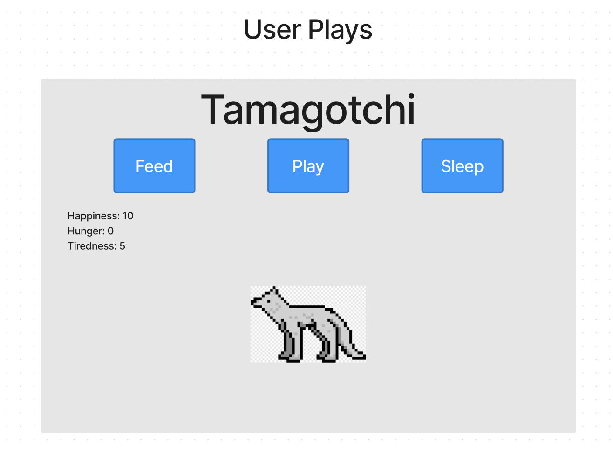
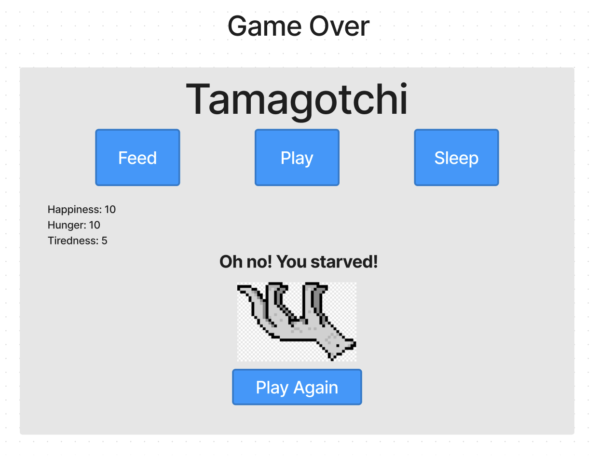

# Let's Code Tamagotchi!

## Intro

So far, we've covered the fundamentals of:

- HTML
- CSS
- JavaScript
- The DOM

Now let's bring these technologies together and learn more about programming as we code the fun game of [Tamagotchi](https://en.wikipedia.org/wiki/Tamagotchi)!

As I code, I will be following the concepts we covered in the [Guide on How to Build a Browser Game](https://gist.github.com/jim-clark/6f1919291f6007b2c0b2c93d925d6bac).

In addition, I will be describing my thought process as we make programming decisions in regards to using data structures, coding functions, etc.

I hope you're as excited as I am - let's get started!

## Planning & Project Setup

### 1. Analyze the app's functionality

Hopefully, you're aware of how Tamagotchi is played.

If not, you can read about it [here](https://en.wikipedia.org/wiki/Tamagotchi#Gameplay), but in summary:

- It's a one player game.
- The player is tasked with keeping a creature alive as long as possible.
- Each creature a player 'raises' has three main statistics; the stats are:
  - Boredom
  - Hunger
  - Sleepiness
- To keep the creature alive, a player must keep 3 stats within a given range, either greater than 0 or below a certain threshold.

### 2. Determine the overall design (look & feel) of the app

Our game of Tamagotchi is going to have a clean/minimalist UI.

### 3. Wireframe the UI

Wireframes provide a blueprint for the HTML & CSS.

They also help reveal what state variables need to be defined.

Here's the wireframe that will guide us today:

<table>
<tr>
<th style="text-align: center"> 
  
  **Game Start** 
</th>

<th style="text-align: center"> 
  
  **Game Over** 
</th>
</tr>
<tr>
<td>



</td>
<td>



</td>
</tr>
</table>

### 4. Pseudocode

Pseudocode outlines the app's logic using plain language. It provides a road map to writing the code itself.

I'll regularly be typing pseudocode as comments within the functions as I code.

### 5. Identify the application's state (application-wide data)

What information does the application need to "remember" throughout its execution?

Use the wireframe and pseudocode to help identify what state needs to be tracked.

### 6. Set up the project

To make it easier for you to share your code and for instructional team to check it, we'll start with an existing repository, which includes HTML/CSS/JS boilerplate. Alternatively, you can create an HTML/CSS/JS-based Repl on [replit.com](https://replit.com/~) and name it **Tamagotchi Game**.

### 7. **Organize the app's JS into sections**

Copy/paste the following comment headings to help you organize your app's code:

```js
/*----- constants -----*/

/*----- state variables -----*/

/*----- cached elements  -----*/

/*----- event listeners -----*/

/*----- functions -----*/
```

The above headings are gold!

> 🚀 With the setup complete, please navigate to the next page where we will begin the code-along!

## Code away!

Again, programming is as much art as science.

I'm going to be developing from scratch while following the process described in Guide on How to Build a Browser Game!

### Start with some HTML & CSS

Our goal is to code the HTML & CSS that results in a UI that looks like our wireframe.


We will need to add elements in **index.html** for the following from top to bottom:

- The heading
- Three buttons
- The stat label
- The stat values

We will also include:

- The Tama graphic
- A gameover message
- A restart button

If an element's content is going to come from the `render()` function, you may want to temporarily include mocked content in the HTML to help with layout and styling. However, once the content is being provided by the `render()` function, you should remove the mocked content from **index.html**.

Along the way, we'll code CSS in **style.css** to layout and style the UI.

<details>
<summary> 
Click for starter HTML/CSS

**Example HTML / CSS / JS starter code**

</summary>

```html
<!DOCTYPE html>
<html lang="en">
  <head>
    <meta charset="UTF-8" />
    <meta name="viewport" content="width=device-width, initial-scale=1.0" />
    <title>Document</title>
    <link rel="stylesheet" href="./css/style.css" />
    <script src="./js/main.js" defer></script>
  </head>

  <body>
    <header>
      <h1 class="game-title">Tamagotchi Code Along</h1>
    </header>

    <main class="container">
      <!-- game interface / UI section -->
      <section id="controller" class="button-wrapper">
        <button>play</button>
        <button>feed</button>
        <button>sleep</button>
      </section>

      <!-- game data section -->
      <section id="stat-display" class="stats-wrapper">
        <p>Happiness: <span id="boredom-stat">...</span></p>
        <p>Hunger: <span id="hunger-stat">...</span></p>
        <p>Tiredness: <span id="sleepiness-stat">...</span></p>
      </section>

      <!-- game display / messaging section -->
      <section id="game-state" class="game-state-wrapper">
        <h2 id="tama-message" class="hidden">
          Oh no! <span id="message-content">You starved!</span>
        </h2>
        
        <button id="restart" class="hidden">Play Again</button>
      </section>
    </main>
  </body>
</html>
```

```css
/* background color: #e6e6e6 */
/* button color:  #4597f8*/

/* global styles  */
* {
  box-sizing: border-box;
}

body {
  min-height: 100vh;
  background-color: #e6e6e6;
  font-family: Arial, Helvetica, sans-serif;
  font-size: 16px;
}

/* element styles */
h1 {
  font-size: 3.5rem;
}

h2 {
  font-size: 1.7rem;
}

/* layout */
.container {
  max-width: 90vw;
  margin: 0 auto;
}

.button-wrapper {
  display: flex;
  justify-content: space-around;
}

.stats-wrapper {
  display: grid;
  grid-template-columns: repeat(3, 1fr);
  text-align: center;
}

.game-state-wrapper {
  display: flex;
  flex-direction: column;
  justify-content: center;
  align-items: center;
}

/* headings */
.game-title {
  text-align: center;
}

/* button styling*/
button {
  font-size: 1.5rem;
  line-height: 1em;
  padding: 1.5rem;
  background-color: #4597f8;
  color: white;
  border: 0;
  border-radius: 0.5rem;
  transition: background-color 2s cubic-bezier(0.075, 0.82, 0.165, 1);
}

button:active {
  background-color: #2e6bb6;
}

/* images */
#tama-graphic {
  max-height: 33vmin;
}

.hidden {
  visibility: hidden;
}

#tama-graphic:hover {
  /* source: https://www.w3schools.com/howto/howto_css_shake_image.asp */
  /* Start the shake animation and make the animation last for 0.5 seconds */
  animation: shake 0.5s;

  /* When the animation is finished, start again */
  animation-iteration-count: infinite;
}

@keyframes shake {
  0% {
    transform: translate(1px, 1px) rotate(0deg);
  }

  10% {
    transform: translate(-1px, -2px) rotate(-1deg);
  }

  20% {
    transform: translate(-3px, 0px) rotate(1deg);
  }

  30% {
    transform: translate(3px, 2px) rotate(0deg);
  }

  40% {
    transform: translate(1px, -1px) rotate(1deg);
  }

  50% {
    transform: translate(-1px, 2px) rotate(-1deg);
  }

  60% {
    transform: translate(-3px, 1px) rotate(0deg);
  }

  70% {
    transform: translate(3px, 1px) rotate(-1deg);
  }

  80% {
    transform: translate(-1px, -1px) rotate(1deg);
  }

  90% {
    transform: translate(1px, 2px) rotate(0deg);
  }

  100% {
    transform: translate(1px, -2px) rotate(-1deg);
  }
}
```

```js
/*----- constants -----*/

/*----- state variables -----*/

/*----- cached elements  -----*/

/*----- event listeners -----*/

/*----- functions -----*/
```

</details>

## `main.js` - Initialize the State Variables

Our next step is to declare, but don't initialize, the application-wide state variables.

The initialization of the variables to their "initial" state should be done within an `initialize()`, or similarly named function, e.g., `init()`.

- Write that `init()` function.

- Invoke `init()` to "kick off" the app.

Now that the `init()` function has initialized the state variables.

```js
// script.js

/*----- state variables -----*/
let boredom; // integer
let hunger; // integer
let sleepiness; // integer

let age; // integer
let cycles; // integer

let timer; // object
let interval; // integer

/*----- cached elements  -----*/

/*----- event listeners -----*/

/*----- functions -----*/
init();

// Initialize all state, then call render()
function init() {
  console.log("game started!");
}
```

Next, let's capture the dom elements that will be used in our game:

```js
/*----- cached elements  -----*/

const boredomStatEl = document.querySelector("#boredom-stat");
const hungerStatEl = document.querySelector("#hunger-stat");
const sleepyStatEl = document.querySelector("#sleepiness-stat");

const gameMessageEl = document.querySelector("#tama-message");

const gameBtnEls = document.querySelectorAll("button");
const gamePlayAgainEl = document.querySelector("#restart");
```

After that, let's add an `INIT_STATE` object constant that will provide our starting values for our state variable.

We will also initialize our async game logic using a `setInterval` with calls a `runGame` function on an interval.

<aside>
💡 Note: The `setInterval`'s second argument is accepts integers (in milliseconds) for duration of delays between executing the `runGame` function. If you want to add difficulty modes later, setting `interval` as a global value can then be changed on init. 
<aside><br>

The last line in `init()` should then call `render();` to render that state to the DOM for the first time.

```js
// script.js
/*----- constants -----*/

const INIT_STATE = {
  boredom: 0,
  hunger: 0,
  sleepiness: 0,
};

// ... other code ...

/*----- functions -----*/
init();

// Initialize all state, then call render()
function init() {
  state = { ...INIT_STATE }; // create a copy of the default data

  age = 0; // integer
  cycles = 0; // integer

  interval = 5000; // integer
  timer = setInterval(runGame, interval); // object

  render();
}
```

### Stub the `runGame()` function

```js
function runGame() {
  console.log("the game is running!");
}
```

The `runGame` function will execute the automated processes of the game, since it is handled by our set interval, each function invoked in `runGame` will execute every 5 seconds (5000 milliseconds).

Out MVP version of the `runGame` will eventually complete the following steps:

- increment the game cycle counter
- evaluate a `continueGame()` condition that will either `updateStats()` or `gameOver()`

Lastly the `runGame` function will execute the `render()` to update the browser content and UI.

### Stub up the main `render()` function.

```js
function render() {
  renderStats();
}

```

### Call and code a `renderStat()` function.

```js

function renderStats() {

  boredomStatEl.textContent = state.boredom;
  hungerStatEl.textContent = state.hunger;
  sleepyStatEl.textContent = state.sleepiness;

}

```
<aside>
💡 Note: If our DOM needed to be updated with more than a few pieces of data, or state properties might be dynamic, we might extend the functionality to use an iterator.

If we use an iterator on our state object to find a referenced DOM element, or capture all relevant DOM elements with a few locally scoped queries, we could handle potentially hundreds of updates automatically!.

An example of this can be found in the `updateStats()` function we will be writing next.

<aside>

### Code the `updateStats()` function

Each stat for your tamagotchi is referenced in the `state` variable. Rather than updating all properties using direct assignment. We will abstract the logic into an `updateStat` helper function. The `updateStat` helper function accepts two arguments: 
- stat: the key in the state object we want to target
- value: the number by which we should change our state (can accept positive or negative numbers)

```js
function updateStat(stat, value){
  // update one property here
}

function updateStats() {
  for (key in state) {
    updateStat(key, Math.floor(Math.random() * 3));
  }
}
```

### Code the `updateStat()` helper function:

The `updateStat` is designed to be used in more than one location, by our `updateStats` function that is called by the runGame looping function. As mentioned above, its purpose is to modify our state programmatically (using variables/dynamic data). Because we are using this function for incrementing, as well as decrementing when a user clicks a button, we want to prevent the number from moving below 0. 

This will prevent a user from 'cheating' by spamming a button click, and will make the game more challenging.  

```js

function updateStat(stat, value) {
  // normalize data to prevent state values less than 0
  if (state[stat] + value >= 0) {
    state[stat] += value;
  } else {
    state[stat] = 0;
  }
}

```
With our current game, the timer will continue to run, adding random values to each stat with each game loop. To have the game end, or keep track of key gameplay milestones, we need to evaluate if the gameover conditions have been met. 

Our next function, `continueGame` will be invoked by `runGame` and will return a boolean value. A predicate function is designed to evaluate some state/game condition and return true or false. 

### Code the `continueGame()` function 

This function uses a combination of the Object `values` method that returns an array of the values for any object. Our `state` object is passed as an argument and it returns an array of three integers: `[ 0,0,0 ]`. If we evaluate the contents of the array data using the array prototype method `every` - we can determine if any of the state values is over ten.  

```js

function continueGame() {
  const testGame = Object.values(state).every((stat) => stat < 10);
  return testGame;
}

```
If `every` one of the values is less then 10, the `every()` method will return true, otherwise false. We can return the value and use the boolean returned by `continueGame` in an if check. 


```js
function runGame() {
  cycles++;
  

  if (continueGame()) {
    updateStats();

    // Icebox - call checkAge helper function to age up Tama
    // Icebox - add aging cycle to calculate aging up tama as a factor of cycles.
    // Icebox - add a message render state or game engine for parsing the state > UI changes. 

  } else {
    // if any stat is >= 10 -> end game cycle
    return gameOver();
  }

  render();
}


```
### Code the `gameOver()` function

```js
function gameOver() {
  // alert player game over
  alert('Game Over!')

  // stop timer
  clearInterval(timer);

  location.reload()
}

```

The above function will be called when any of the `state` properties stores a number 10 or greater. It is called immediately in the runGame cycle. This MVP version uses an alert to stop the code from executing and then invokes a `clearInterval` to prevent the `runGame` function from continuing.The `location` object is part of the system your browser uses to control which webpage you are navigating to. We can use the `.reload()` method to refresh the page for the user.

This will cause the dom to completey refresh and the `init()` function will be called again.


### Code the `handleBtnClick` event listener function

> _"In response to user interaction, update all impacted state, then call render()"_

Now that we have created a game that starts, and ends, now it's time to handle when the user clicks a game button! This user-click will prolong the game and allow for interactive game play. 

Let's add an event listener for when the `[Play]` `[Eat]` `[Sleep]` buttons is clicked are clicked .

The `handleBtnClick` handler will do the following: 
1. Determine which button was clicked and cache the btn innerText
1. Calculate a dynamic decrementing value
1. Invoke the `updateStat` function
1. Render the updated state

You might notice the `convertProp` object below - since our button copy does not match 1:1 with the `state` keys, we can use a lookup table to map our button text to the correct state key. 

If we wanted to be add some error checking, we could add a predicate to wrap our updateState so that we do not "pollute" our state with additional properties. 

```js
/*----- event listeners -----*/
gameBtnEls.forEach((btn) => btn.addEventListener("click", handleBtnClick));

/*----- functions -----*/
function handleBtnClick(e) {
  
  const convertProp = {
    feed: "hunger",
    sleep: "sleepiness",
    play: "boredom",
  };
  
  
  const btnText = convertProp[e.target.innerText];
  
  
  const newValue = -1 * (3 + Math.floor(Math.random() * 3));
  
  
  updateStat(btnText, newValue);

  
  render();
}
```


### Update the `gameOver()` to add UI updates

Rather than simply running the `alert` function to end our game, let's add some UI updates instead. We will remove two instances of a CSS `hidden` class from our UI message element and the "Play Again" button. 

```css
.hidden {
  visibility: hidden
}

```

By removing the class (that was added at load time) we can 'reveal' some new UI elements to the player. 

```js
function gameOver() {
  // alert player game over
  gamePlayAgainEl.classList.remove("hidden");
  gameMessageEl.classList.remove("hidden");

  // stop timer
  clearInterval(timer);
}
```

We also need some way to 'restart' the game. When a user `clicks` the `restart` button, the `init` method may be called directly when our `restart` button is clicked. Let's add a click handler to our `event listeners` section of our JS. 

```js

gamePlayAgainEl.addEventListener("click", init);

```

### Update the `init()` to add UI updates

Taking this approach one step further, if we want to clear out the game over message, we need some way of 'hiding' the UI elements revealed when the game is over. Let's create a `resetUI` function that will be called when the game loads/restarts.

```js
function init() {
  // clear the end-game message
  resetUI();

  // ... the rest of our code
}

function resetUI() {
  // display game over messaging
  gamePlayAgainEl.classList.add("hidden");
  gameMessageEl.classList.add("hidden");
}

```

Wow! Congrats on coding a cool game of Tamagotchi! 🎉

Hopefully, you're inspired to apply the process we followed today to code another game!

### Future Stretch (Icebox) Features
- Add a start button that reveals the stats and starts the game on click (triggers `init()`).
- Add some more styling 
- Add an `ageUp()` function that updates the creatures age by 1 for every 20, 30, or 50 cycles.
- Add a `Game Engine` for added dynamic UI that incorporates the current `state` and `age` data. 

<br>

<details>
<summary>
 🆘 Click for help if you've tried but unable to get your code to run successfully but were blocked.
</summary>

```js
// script.js

/*----- constants -----*/

const INIT_STATE = {
  boredom: 0,
  hunger: 0,
  sleepiness: 0,
};

// game engine - icebox feature

/*----- state variables -----*/
let state;

let age; // integer
let cycles; // integer

let timer; // object
let interval; // integer

/*----- cached elements  -----*/

const boredomStatEl = document.querySelector("#boredom-stat");
const hungerStatEl = document.querySelector("#hunger-stat");
const sleepyStatEl = document.querySelector("#sleepiness-stat");

const gameMessageEl = document.querySelector("#tama-message");

const gameBtnEls = document.querySelectorAll("button");
const gamePlayAgainEl = document.querySelector("#restart");

/*----- event listeners -----*/
gameBtnEls.forEach((btn) => btn.addEventListener("click", handleBtnClick));
gamePlayAgainEl.addEventListener("click", init);

/*----- functions -----*/

function handleBtnClick(e) {
  const convertProp = {
    feed: "hunger",
    sleep: "sleepiness",
    play: "boredom",
  };
  const btnText = convertProp[e.target.innerText];
  const newValue = -1 * (3 + Math.floor(Math.random() * 3));

  updateStat(btnText, newValue);

  render();
}

// Initialize all state, then call render()
function init() {
  resetUI();
  state = { ...INIT_STATE };

  // Icebox - add aging cycle

  age = 0; // integer
  cycles = 0; // integer

  interval = 1000; // integer
  timer = setInterval(runGame, interval); // object

  render();
}

function render() {
  renderStats();
  // Icebox - add conditional animations function call
}

function renderStats() {
  boredomStatEl.textContent = state.boredom;
  hungerStatEl.textContent = state.hunger;
  sleepyStatEl.textContent = state.sleepiness;
}

function runGame() {
  cycles++;

  if (continueGame()) {
    updateStats();
    // Icebox - call checkAge helper function to age up Tama
  } else {
    return gameOver();
  }

  render();
}

function continueGame() {
  const testGame = Object.values(state).every((stat) => stat < 10);
  return testGame;
}

function updateStats() {
  for (key in state) {
    updateStat(key, Math.floor(Math.random() * 3));
  }
}

function updateStat(stat, value) {
  if (state[stat] + value >= 0) {
    state[stat] += value;
  } else {
    state[stat] = 0;
  }
}

function gameOver() {
  // alert player game over
  gamePlayAgainEl.classList.remove("hidden");
  gameMessageEl.classList.remove("hidden");

  // stop timer
  clearInterval(timer);
}

function resetUI() {
  gamePlayAgainEl.classList.add("hidden");
  gameMessageEl.classList.add("hidden");
}

init();
```

</details>
